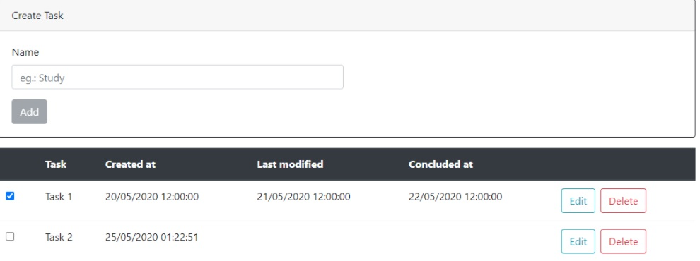

# CRUD using React and NetCore

# Todo List

Neste tutorial vamos criar um ToDo app usando React no frontend e NetCore no backend. 

Este app possui algumas regras:

O botão Add só é habilitado quando algum valor é inputado

Quando o usuario clica no Checkbox a coluna Concluded at passa a exibir a data que a tarefa foi concluída

Quando o botão Edit é acionado o botão Add é escondido e o botão Save Changes é exibido para salvar as altereçãoes

Qualquer edição muda o valor da coluna Last modified

Esse deve ser o resultado final



## 🚀 Começando
Para executar a aplicação, rodar o comando dentro da pasta raiz
#dotnet run


### 📋 Pré-requisitos
.

```


## 🛠️ Construído com
 


## 🖇️ Colaborando


## 📌 Versão


## ✒️ Autores


## 📄 Licença


## 🎁 Expressões de gratidão


---
⌨️ com ❤️ por [Rodrigo Camargo]() 😊
